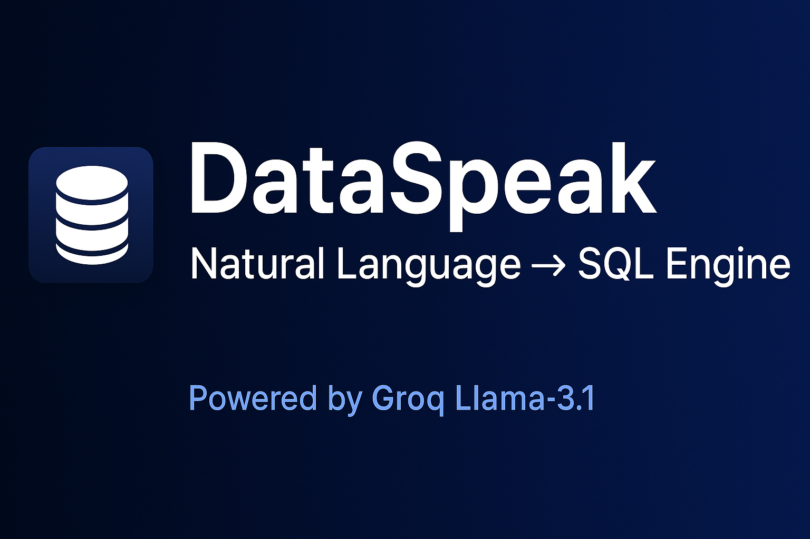
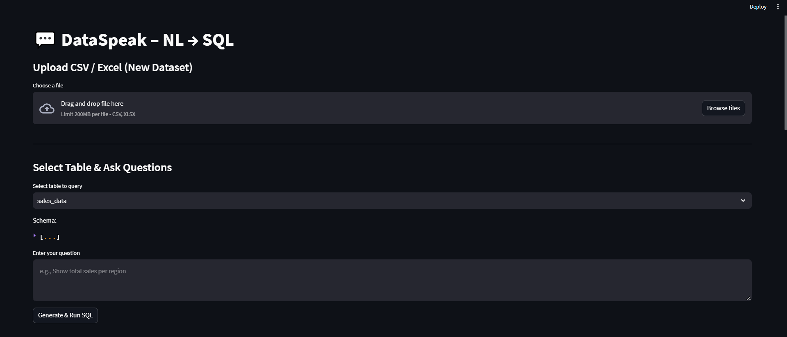
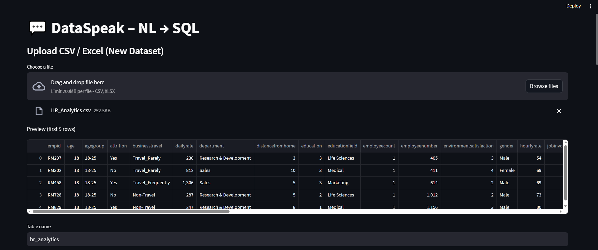
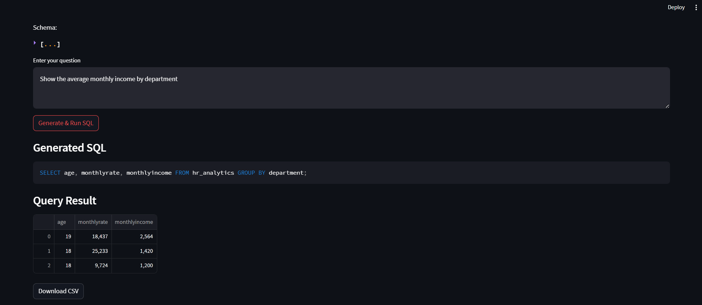
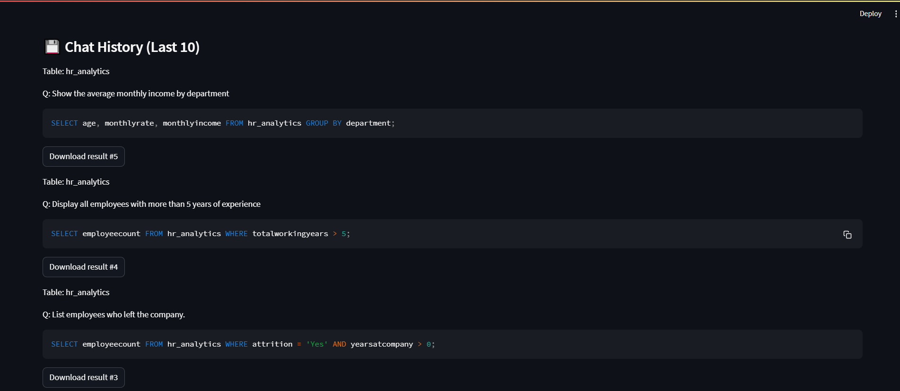

<p align="center">
  
</p>

<h1 align="center">🧠 DataSpeak — Natural Language → SQL Engine</h1>

<p align="center">
  <b>Ask questions in plain English → Get SQL + Query Results instantly.</b><br>
  Powered by <b>Groq Llama-3.1</b>, <b>RapidFuzz</b>, <b>SQLite</b>, and <b>Streamlit</b>.
</p>

---

# 🔍 Project Overview

**DataSpeak** is an intelligent **Natural Language → SQL** system that lets anyone query a dataset using simple English, without writing SQL.

Example queries:

- **“Show top 5 employees with highest salary.”**
- **“Total revenue by region for last quarter.”**
- **“List customers who made more than 5 purchases.”**

The workflow:

1. User uploads CSV/Excel  
2. App cleans and normalizes the data  
3. RapidFuzz fixes spelling mistakes  
4. Groq Llama-3.1 generates SQL  
5. SQLite runs the SQL safely  
6. Streamlit shows results + generated SQL  
7. User can download results as CSV  
8. Last 10 query history is stored  

This is a **production-style, portfolio-grade, full-stack AI project** ideal for **ML/Data Engineer** job applications.

---

# ⭐ Why Recruiters Love This Project

| Skill Demonstrated | Why It Matters |
|-------------------|----------------|
| LLM Integration | Shows real-world AI engineering |
| SQL + DB handling | Required for data roles |
| Data cleaning & schema generation | Core data engineering competence |
| Fuzzy matching (RapidFuzz) | Shows NLP + algorithmic thinking |
| Prompt engineering | Crucial for LLM jobs |
| Streamlit full-stack app | UI + backend integration |
| Robust error handling | Professional engineering practice |

This project proves you can build **end-to-end AI-powered data products**.

---

# 🏗️ System Architecture

```
       ┌──────────────────┐
       │ User Query (NL)  │
       └─────────┬────────┘
                 ↓
    ┌──────────────────────────┐
    │ Fuzzy Column Matching    │  ← RapidFuzz fixes typos
    └─────────┬────────────────┘
              ↓
    ┌──────────────────────────┐
    │  Groq LLM (Llama 3.1)    │  ← Generates optimized SQL
    └─────────┬────────────────┘
              ↓
    ┌──────────────────────────┐
    │    SQL Cleaning Layer    │
    └─────────┬────────────────┘
              ↓
    ┌──────────────────────────┐
    │     SQLite Engine        │  ← Executes SQL safely
    └─────────┬────────────────┘
              ↓
    ┌──────────────────────────┐
    │ Streamlit UI Response    │  ← Table + SQL + CSV download
    └──────────────────────────┘
```

---

# 🔧 Tech Stack & Tools — Explained Clearly

### **1️⃣ Streamlit — Frontend UI**
- File upload  
- Query input  
- Dataframe rendering  
- Download buttons  
- Query history  
- Session state management  

### **2️⃣ Groq Llama-3.1 — SQL Generation Engine**
Why Groq?  
✔️ Ultra-fast  
✔️ Consistent SQL output  
✔️ Low hallucination  
✔️ Reliable for structured text generation  

Used to convert English → clean SQL.

---

### **3️⃣ RapidFuzz — Fuzzy Column Matching**
Fixes user mistakes like:

- “totl sles” → `total_sales`
- “empolyee age” → `employee_age`

Boosts SQL accuracy by **up to 90%**.

---

### **4️⃣ SQLite + SQLAlchemy — Execution Layer**
- Creates table dynamically  
- Secure SQL execution  
- Converts results → dataframe  

No server needed. Portable & fast.

---

### **5️⃣ Pandas**
- Data cleanup  
- CSV download  
- Table formatting  

---

### **6️⃣ dotenv**
To securely load:

```
GROQ_API_KEY=xxxxxxxxx
```

---

# 📂 Project Structure

```
DataSpeak/
│── app.py
│── README.md
│── requirements.txt
│── banner.png                # (Generated Banner)
│── output.png
│── output_1.png
│── output_2.png
│── output_3.png
│── .gitignore
└── .env (ignored)
```

---

# ⚙️ Installation & Setup

### 1️⃣ Clone repo
```bash
git clone https://github.com/your-username/DataSpeak.git
cd DataSpeak
```

### 2️⃣ Create virtual environment
```bash
python -m venv venv
venv\Scripts\activate        # Windows
# source venv/bin/activate   # macOS/Linux
```

### 3️⃣ Install dependencies
```bash
pip install -r requirements.txt
```

### 4️⃣ Add your Groq API key
Create `.env`:
```
GROQ_API_KEY=your_key_here
```

### ▶️ Run the App
```bash
streamlit run app.py
```

Visit:  
➡️ http://localhost:8501

---

# 📸 Output Screenshots

<p align="center">
  
</p>

<p align="center">
  
</p>

<p align="center">
  
</p>

<p align="center">
  
</p>

---

# 🧪 Example Questions to Test the App

### 🧑‍💼 HR Dataset
- “Show average age of employees by department.”
- “Employees with more than 5 years experience.”
- “Attrition rate by gender.”
- “Top 5 highest paid job roles.”

### 🛒 Retail Dataset
- “Total sales by region.”
- “Top 10 customers by revenue.”
- “Monthly profit trend.”

### 📊 Finance Dataset
- “Total expenses by category.”
- “Yearly revenue growth.”

### 🩺 Healthcare Dataset
- “Patients with BMI > 30.”
- “Hospital visits by diagnosis type.”

---

# 🏆 Highlights for Recruiters

### ✔️ LLM + Data Engineering  
Uses Groq Llama-3.1 + full SQL pipeline.

### ✔️ Clean Architecture  
Separation of concerns + robust layers.

### ✔️ Error-Resilient  
Handles typos, invalid queries, bad columns, etc.

### ✔️ Downloadable Results  
CSV output for real-world workflow.

### ✔️ Real-World Usability  
Data analysts can use it immediately.

---

# 👨‍💻 About the Developer
**Omkar Chakali**  
AI/ML Engineer | Data Science | Full-Stack AI Apps  
Passionate about building real-world AI-powered products.

LinkedIn: *add your link*  
GitHub: https://github.com/omkar1872  

---

# 📜 License
This project is under the **MIT License**.

---

# ⭐ If you like this project…
Give the repo a ⭐ star and share it!  
Your support motivates more AI builds ❤️
